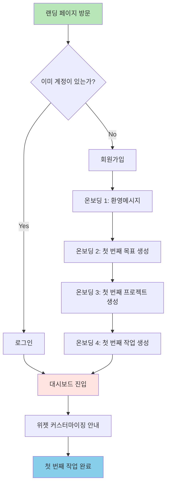
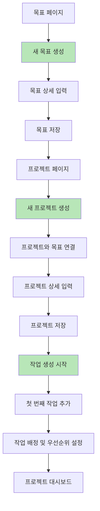
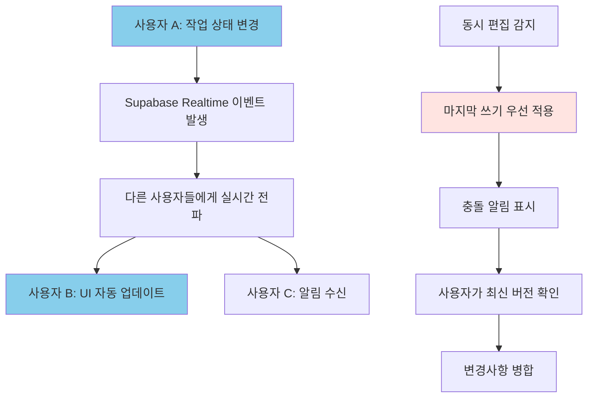

# 📐 PM System 2025 와이어프레임 설계 문서

## 1. 문서 개요 (Document Overview)

### 1.1 프로젝트 정보
- **프로젝트명**: PM System 2025
- **목적**: 개인 및 소규모 팀(1-5명)을 위한 초경량 프로젝트 관리 도구
- **핵심 원칙**: "5분 내 시작" - 회원가입 없이 즉시 사용 가능
- **대상 플랫폼**: 웹 (Next.js 15.1.0 + App Router), PWA 대응

### 1.2 기술 스택
```
Frontend: Next.js 15.1.0 + Turbopack + TypeScript
UI Framework: Tailwind CSS 3.4.1 + Radix UI + shadcn/ui
State: TanStack Query v5 (서버) + Zustand v4 (클라이언트)
Backend: Supabase (PostgreSQL 15 + Auth + Realtime + Storage)
Deployment: Vercel
```

### 1.3 디자인 철학
- **모바일 퍼스트**: 320px부터 시작하는 점진적 향상
- **실시간 협업**: 마지막 쓰기 우선 정책으로 충돌 최소화
- **접근성 우선**: WCAG 2.1 AA 준수
- **성능 최적화**: Core Web Vitals 달성 (LCP <2.5s, FID <100ms)

### 1.4 색상 시스템
```css
/* 주요 색상 */
mint: #B8E6B8      /* 주 색상 - 액션, 성공 */
peach: #FFE4E1     /* 보조 색상 - 경고, 알림 */
sky: #87CEEB       /* 강조 색상 - 링크, 정보 */
cream: #FFFEF9     /* 배경 색상 - 기본 배경 */
charcoal: #4A5568  /* 텍스트 색상 - 본문 텍스트 */

/* 다크모드 */
background: #1A1A1A
surface: #2D2D2D
text: #E5E5E5
```

---

## 2. 와이어프레임 목록 (Wireframe Inventory)

### 2.1 인증 & 온보딩 (4개 화면)
- **WF-01**: 랜딩 페이지 (`/`)
- **WF-02**: 로그인 페이지 (`/auth/login`)
- **WF-03**: 회원가입 페이지 (`/auth/signup`)
- **WF-04**: 온보딩 플로우 (`/onboarding`)

### 2.2 대시보드 (6개 화면)
- **WF-05**: 메인 대시보드 (`/dashboard`)
- **WF-06**: 위젯 커스터마이징 모달 (`/dashboard?customize=true`)
- **WF-07**: 실시간 진행도 위젯
- **WF-08**: 오늘의 작업 위젯
- **WF-09**: 주간 타임라인 위젯
- **WF-10**: 날씨 & 시계 위젯

### 2.3 3단계 계층 관리 (9개 화면)
- **WF-11**: 목표(Goals) 목록 (`/goals`)
- **WF-12**: 목표 생성/편집 (`/goals/new`, `/goals/[id]/edit`)
- **WF-13**: 프로젝트(Projects) 목록 (`/projects`)
- **WF-14**: 프로젝트 생성/편집 (`/projects/new`, `/projects/[id]/edit`)
- **WF-15**: 프로젝트 상세 (`/projects/[id]`)
- **WF-16**: 작업(Tasks) 목록 (`/tasks`)
- **WF-17**: 작업 생성/편집 (`/tasks/new`, `/tasks/[id]/edit`)
- **WF-18**: 작업 상세 (`/tasks/[id]`)
- **WF-19**: 빠른 작업 생성 모달

### 2.4 6가지 뷰 시스템 (6개 화면)
- **WF-20**: 테이블 뷰 (`/projects?view=table`)
- **WF-21**: 칸반 뷰 (`/projects?view=kanban`)
- **WF-22**: 캘린더 뷰 (`/projects?view=calendar`)
- **WF-23**: 타임라인/간트 뷰 (`/projects?view=timeline`)
- **WF-24**: 갤러리 뷰 (`/projects?view=gallery`)
- **WF-25**: 리스트 뷰 (`/projects?view=list`)

### 2.5 공통 컴포넌트 (6개 화면)
- **WF-26**: 사이드바 네비게이션
- **WF-27**: 모바일 네비게이션 메뉴
- **WF-28**: 검색 오버레이
- **WF-29**: 알림 센터
- **WF-30**: 사용자 프로필 드롭다운
- **WF-31**: 설정 페이지

---

## 3. 핵심 화면 와이어프레임 (Core Screen Wireframes)

### 3.1 메인 대시보드 (WF-05) - Desktop 1440px
```
┌──────────────────────────────────────────────────────────────────────────────────────┐
│ [🏠 PM System]    [🔍 Search]              [🔔 3] [👤 Profile] [⚙️ Settings] [🌙]  │
├─────────┬────────────────────────────────────────────────────────────────────────────────┤
│ Goals   │ ┌─ Widget Grid (12 columns, responsive) ─────────────────────────────────────┐ │
│ ├─ Goal1│ │ ┌─[Clock Widget]─┐ ┌─[Weather Widget]─┐ ┌─[Progress Widget]─────┐  │ │
│ ├─ Goal2│ │ │   14:25:30     │ │   ☀️ 23°C       │ │ ████████░░ 80%       │  │ │
│ ├─ Goal3│ │ │   2024.01.15   │ │   Seoul, Clear   │ │ 3 Goals / 12 Projects │  │ │
│         │ │ └────────────────┘ └─────────────────┘ └─────────────────────┘  │ │
│Projects │ │ ┌─[Today's Focus Widget]─────────────────────────────────────────────┐ │ │
│ ├─Proj1 │ │ │ 🎯 Today's Tasks (5)                                          │ │ │
│ ├─Proj2 │ │ │ ☐ Design system documentation                [High] [2h]     │ │ │
│ ├─Proj3 │ │ │ ☑ Fix authentication bug                    [Critical] [30m] │ │ │
│         │ │ │ ☐ Update project timeline                    [Medium] [1h]    │ │ │
│Tasks    │ │ └────────────────────────────────────────────────────────────────────┘ │ │
│ ├─Task1 │ │ ┌─[Active Projects Gallery]─────────────────────────────────────────┐ │ │
│ ├─Task2 │ │ │ [Project Card 1] [Project Card 2] [Project Card 3]           │ │ │
│ ├─Task3 │ │ │ 🔥 Website Redesign  📊 Analytics  🎨 Design System          │ │ │
│         │ │ │ ████████░░ 85%      ████░░░░░░ 40%  ██████████ 100%          │ │ │
│         │ │ └────────────────────────────────────────────────────────────────────┘ │ │
│         │ │ ┌─[Weekly Timeline Widget]──────────────────────────────────────────┐ │ │
│         │ │ │ Mon  Tue  Wed  Thu  Fri  Sat  Sun                             │ │ │
│         │ │ │  │    │    ▓    ▓    │    │    │   ← Design Review            │ │ │
│         │ │ │  ▓    │    │    │    ▓    │    │   ← Development Sprint       │ │ │
│         │ │ └────────────────────────────────────────────────────────────────────┘ │ │
│         │ └────────────────────────────────────────────────────────────────────────────┘ │
└─────────┴────────────────────────────────────────────────────────────────────────────────┘
```

### 3.2 칸반 뷰 (WF-21) - Desktop 1440px
```
┌──────────────────────────────────────────────────────────────────────────────────────┐
│ [← Back] Projects / Website Redesign / Kanban View    [⚙️ View Settings] [+ Add Task] │
├──────────────────────────────────────────────────────────────────────────────────────┤
│ ┌─ Kanban Board (Horizontal Scroll) ────────────────────────────────────────────────┐ │
│ │ ┌──[📋 To Do]──┐ ┌──[🔄 In Progress]┐ ┌──[👀 Review]──┐ ┌──[✅ Done]──┐ │ │
│ │ │   (4 tasks)  │ │    (2 tasks)     │ │   (3 tasks)   │ │  (8 tasks) │ │ │
│ │ ├──────────────┤ ├─────────────────┤ ├───────────────┤ ├────────────┤ │ │
│ │ │[Task Card 1] │ │ [Task Card A]   │ │ [Task Card X] │ │[Task Card] │ │ │
│ │ │Design        │ │ 🔥 Development  │ │ Code Review   │ │Bug Fix     │ │ │
│ │ │Homepage      │ │ 👤 John, Sarah  │ │ 👤 Mike       │ │✅ Complete │ │ │
│ │ │👤 Alex       │ │ ⏱ 2 days left  │ │ ⏱ 4h left    │ │Jan 10      │ │ │
│ │ │🏷 UI/UX      │ │ 🏷 Frontend     │ │ 🏷 QA         │ │            │ │ │
│ │ │              │ │                 │ │               │ │            │ │ │
│ │ │[Task Card 2] │ │ [Task Card B]   │ │ [Task Card Y] │ │[Task Card] │ │ │
│ │ │API Schema    │ │ 🚨 Bug Fix      │ │ Design Review │ │Testing     │ │ │
│ │ │👤 Sarah      │ │ 👤 Mike         │ │ 👤 Alex       │ │✅ Complete │ │ │
│ │ │🏷 Backend    │ │ ⏱ Overdue 1d    │ │ ⏱ 1h left    │ │Jan 09      │ │ │
│ │ │              │ │ 🏷 Critical     │ │ 🏷 Design     │ │            │ │ │
│ │ │              │ │                 │ │               │ │            │ │ │
│ │ │[+ Add Task]  │ │ [+ Add Task]    │ │ [+ Add Task]  │ │[Collapsed] │ │ │
│ │ └──────────────┘ └─────────────────┘ └───────────────┘ └────────────┘ │ │
│ └────────────────────────────────────────────────────────────────────────────────────┘ │
└──────────────────────────────────────────────────────────────────────────────────────┘
```

### 3.3 모바일 대시보드 (WF-05) - Mobile 375px
```
┌─────────────────────────────────────────┐
│ [☰] PM System    [🔍] [🔔3] [👤] [🌙] │
├─────────────────────────────────────────┤
│ ┌─ Widget Stack (Mobile) ─────────────┐ │
│ │ ┌─[Time & Weather]──────────────────┐ │ │
│ │ │ 14:25:30  |  ☀️ 23°C Seoul      │ │ │
│ │ │ Monday, January 15, 2024         │ │ │
│ │ └──────────────────────────────────┘ │ │
│ │ ┌─[Overall Progress]──────────────────┐ │ │
│ │ │ 📊 Project Progress               │ │ │
│ │ │ ████████████████░░░░ 80%          │ │ │
│ │ │ 8 of 10 milestones completed     │ │ │
│ │ └──────────────────────────────────┘ │ │
│ │ ┌─[Today's Focus]───────────────────┐ │ │
│ │ │ 🎯 Today's Tasks (3 remaining)   │ │ │
│ │ │ ☑ Morning standup      [Done]    │ │ │
│ │ │ ☐ Review design files  [2h]      │ │ │
│ │ │ ☐ Update documentation [30m]     │ │ │
│ │ │ [+ Quick Add]                    │ │ │
│ │ └──────────────────────────────────┘ │ │
│ │ ┌─[Active Projects]─────────────────┐ │ │
│ │ │ 🔥 Website Redesign    [View] ↗  │ │ │
│ │ │ ████████████████░░░░ 85%          │ │ │
│ │ │ 📊 Analytics Dashboard [View] ↗  │ │ │  
│ │ │ ████████░░░░░░░░░░░░ 40%          │ │ │
│ │ │ [See All Projects]               │ │ │
│ │ └──────────────────────────────────┘ │ │
│ └─────────────────────────────────────┘ │
├─────────────────────────────────────────┤
│ [🏠] [📊] [✅] [💬] [⚙️]               │
└─────────────────────────────────────────┘
```

### 3.4 프로젝트 상세 뷰 (WF-15) - Desktop 1440px
```
┌──────────────────────────────────────────────────────────────────────────────────────┐
│ [← Goals] / Website Redesign Project                           [⚙️] [⭐] [👥] [📤]  │
├──────────────────────────────────────────────────────────────────────────────────────┤
│ ┌─ Project Header ──────────────────────────────────────────────────────────────────┐ │
│ │ 🎨 Website Redesign Project                                    Status: In Progress │ │
│ │ Modern, responsive redesign of company website with new branding                   │ │
│ │ 👥 Team: Alex K, Sarah M, John D, Mike R (4 members)          🗓 Due: Feb 28, 2024 │ │
│ │ 📊 Progress: ████████████████████░░░░░░░░░░ 75% (15/20 tasks) ⏱ 23 days left     │ │
│ │ 🏷 Tags: [Frontend] [Design] [High Priority] [Q1-2024]                            │ │
│ └───────────────────────────────────────────────────────────────────────────────────┘ │
│ ┌─ Tab Navigation ──────────────────────────────────────────────────────────────────┐ │
│ │ [📋 Overview] [✅ Tasks] [📊 Analytics] [💬 Activity] [📁 Files] [⚙️ Settings]    │ │
│ └───────────────────────────────────────────────────────────────────────────────────┘ │
│ ┌─ Three Column Layout ─────────────────────────────────────────────────────────────┐ │
│ │ ┌─ Task Summary ────┐ ┌─ Recent Activity ─────┐ ┌─ Project Info ────────┐        │ │
│ │ │ 📋 Task Status    │ │ 💬 Team Activity      │ │ 📅 Timeline           │        │ │
│ │ │ ✅ Done: 15       │ │ Sarah completed       │ │ Started: Dec 15, 2023 │        │ │
│ │ │ 🔄 In Progress: 3 │ │ "Design homepage"     │ │ Duration: 75 days     │        │ │
│ │ │ 📋 To Do: 2       │ │ 5 minutes ago         │ │ Sprint: Week 8/12     │        │ │
│ │ │ 🚫 Blocked: 0     │ │                       │ │                       │        │ │
│ │ │                   │ │ John started          │ │ 💰 Budget             │        │ │
│ │ │ 🎯 Milestones     │ │ "API Integration"     │ │ Allocated: $12,000    │        │ │
│ │ │ ✅ Design Phase   │ │ 2 hours ago           │ │ Spent: $8,500         │        │ │
│ │ │ 🔄 Development    │ │                       │ │ Remaining: $3,500     │        │ │
│ │ │ ⏸️ Testing        │ │ Mike commented on     │ │                       │        │ │
│ │ │ 📋 Launch         │ │ "Review design files" │ │ 🔗 Links              │        │ │
│ │ │                   │ │ 1 day ago             │ │ Figma Design          │        │ │
│ │ │ [View All Tasks]  │ │ [View All Activity]   │ │ GitHub Repo           │        │ │
│ │ └───────────────────┘ └───────────────────────┘ │ Staging Environment   │        │ │
│ │                                                   │ [+ Add Link]          │        │ │
│ │                                                   └───────────────────────┘        │ │
│ └───────────────────────────────────────────────────────────────────────────────────┘ │
└──────────────────────────────────────────────────────────────────────────────────────┘
```

### 3.5 작업 생성 모달 (WF-17) - Overlay
```
┌─────────────────────────── Create New Task ────────────────────────────┐
│                                                               [✕ Close] │
├─────────────────────────────────────────────────────────────────────────┤
│ ┌─ Basic Information ────────────────────────────────────────────────┐   │
│ │ Task Title *                                                       │   │
│ │ ┌─────────────────────────────────────────────────────────────────┐ │   │
│ │ │ Implement user authentication system                            │ │   │
│ │ └─────────────────────────────────────────────────────────────────┘ │   │
│ │                                                                     │   │
│ │ Description                                                         │   │
│ │ ┌─────────────────────────────────────────────────────────────────┐ │   │
│ │ │ Create secure login/logout functionality with JWT tokens.      │ │   │
│ │ │ Include password reset and email verification features.        │ │   │
│ │ └─────────────────────────────────────────────────────────────────┘ │   │
│ └─────────────────────────────────────────────────────────────────────┘   │
│ ┌─ Organization ──────────────────────────────────────────────────────┐   │
│ │ Project *          │ Assignee           │ Priority                 │   │
│ │ [Website Redesign▼]│ [Sarah Martinez ▼] │ [High Priority ▼]       │   │
│ │                    │                    │                         │   │
│ │ Due Date           │ Estimated Hours    │ Labels                  │   │
│ │ [📅 Jan 25, 2024]   │ [8 hours]          │ [🏷 Backend] [+ Add]     │   │
│ └─────────────────────────────────────────────────────────────────────┘   │
│ ┌─ Subtasks (Optional) ───────────────────────────────────────────────┐   │
│ │ ☐ Set up authentication middleware                                  │   │
│ │ ☐ Create login/signup forms                                        │   │
│ │ ☐ Implement JWT token management                                   │   │
│ │ ☐ Add password reset functionality                                 │   │
│ │ [+ Add Subtask]                                                     │   │
│ └─────────────────────────────────────────────────────────────────────┘   │
│ ┌─ Dependencies & Attachments ────────────────────────────────────────┐   │
│ │ Depends On: [Select Tasks ▼]                                       │   │
│ │ Attachments: [📎 Drag files here or click to browse]               │   │
│ └─────────────────────────────────────────────────────────────────────┘   │
│                                                                         │
│ ┌─ Actions ──────────────────────────────────────────────────────────┐   │
│ │                              [Cancel] [Save Draft] [Create Task]   │   │
│ └─────────────────────────────────────────────────────────────────────┘   │
└─────────────────────────────────────────────────────────────────────────┘
```

---

## 4. 주요 사용자 플로우 (Key User Flows)

### 4.1 5분 내 시작하기 플로우


### 4.2 프로젝트 생성 & 관리 플로우


### 4.3 실시간 협업 플로우


---

## 5. 컴포넌트 라이브러리 참조 (Component Library Reference)

### 5.1 Radix UI + shadcn/ui 컴포넌트 매핑

#### 5.1.1 기본 컴포넌트
```typescript
// 버튼 계층 구조 (Radix UI Primitive 기반)
Button → RadixUI.Button + CVA variants
├─ Primary (mint color, solid)
├─ Secondary (peach color, outline)  
├─ Tertiary (ghost, text only)
└─ Destructive (red color, solid)

// 입력 컴포넌트 (shadcn/ui + React Hook Form)
Input → RadixUI.Input + Zod validation
Select → RadixUI.Select + portal
Textarea → RadixUI.Textarea + auto-resize
DatePicker → RadixUI.Calendar + date-fns
```

#### 5.1.2 레이아웃 컴포넌트
```typescript
// Next.js 15 App Router 패턴
Layout → app/layout.tsx (RootLayout)
├─ Sidebar → RadixUI.NavigationMenu
├─ Header → Next.js Server Component
├─ MobileNav → RadixUI.Sheet (slide-over)
└─ Footer → Next.js Server Component

// 그리드 시스템 (Tailwind CSS)
Container → max-w-7xl mx-auto px-4
Grid → grid grid-cols-12 gap-4
Column → col-span-1 to col-span-12 + responsive variants
```

#### 5.1.3 피드백 컴포넌트
```typescript
// 상태 표시
Toast → RadixUI.Toast + Sonner integration
Dialog → RadixUI.Dialog + focus management
AlertDialog → RadixUI.AlertDialog + confirmation
Tooltip → RadixUI.Tooltip + delay control
Badge → CVA variants + responsive sizing
```

### 5.2 커스텀 컴포넌트 정의

#### 5.2.1 프로젝트 특화 컴포넌트
```typescript
// 대시보드 위젯 시스템
Widget → BaseWidget + drag-drop + resize
├─ ClockWidget (time, date display)
├─ WeatherWidget (location-based, API integration)
├─ ProgressWidget (animated progress bars)
├─ TaskWidget (quick task management)
└─ TimelineWidget (weekly schedule view)

// 3단계 계층 컴포넌트
HierarchyCard → Goals/Projects/Tasks common layout
├─ GoalCard (color-coded, progress indicator)
├─ ProjectCard (team members, deadline, status)
└─ TaskCard (assignee, priority, time estimate)
```

#### 5.2.2 뷰 시스템 컴포넌트
```typescript
// 6가지 뷰 패턴
ViewSwitcher → Tab navigation + state management
├─ TableView (TanStack Table + sorting, filtering)
├─ KanbanView (@dnd-kit + virtual scrolling)
├─ CalendarView (React Big Calendar + events)
├─ TimelineView (Gantt chart + dependencies)
├─ GalleryView (Masonry grid + image preview)
└─ ListView (Infinite scroll + search)
```

---

## 6. 반응형 동작 (Responsive Behavior)

### 6.1 Tailwind CSS Breakpoint 전략

#### 6.1.1 모바일 퍼스트 접근법
```css
/* Base (320px+): 기본 모바일 스타일 */
.dashboard-grid {
  @apply grid grid-cols-1 gap-4 p-4;
}

/* sm (640px+): 큰 모바일, 작은 태블릿 */
.dashboard-grid {
  @apply sm:grid-cols-2 sm:gap-6 sm:p-6;
}

/* md (768px+): 태블릿 */
.dashboard-grid {
  @apply md:grid-cols-3 md:gap-8 md:p-8;
}

/* lg (1024px+): 작은 데스크톱 */
.dashboard-grid {
  @apply lg:grid-cols-4 lg:gap-10 lg:p-10;
}

/* xl (1280px+): 큰 데스크톱 */
.dashboard-grid {
  @apply xl:grid-cols-6 xl:gap-12 xl:p-12;
}
```

#### 6.1.2 컴포넌트별 반응형 규칙
```css
/* 사이드바 네비게이션 */
.sidebar {
  /* Mobile: 숨김, 햄버거 메뉴로 접근 */
  @apply hidden;
  
  /* md+: 고정 사이드바로 표시 */
  @apply md:flex md:w-64 md:flex-col md:fixed md:left-0 md:top-0 md:h-full;
}

/* 카드 컴포넌트 레이아웃 */
.project-card {
  /* Mobile: 전체 너비 */
  @apply w-full;
  
  /* sm+: 2열 그리드 */
  @apply sm:w-1/2;
  
  /* lg+: 3열 그리드 */
  @apply lg:w-1/3;
  
  /* xl+: 4열 그리드 */
  @apply xl:w-1/4;
}
```

### 6.2 뷰포트별 UX 최적화

#### 6.2.1 모바일 (320px - 767px)
- **네비게이션**: 하단 탭 바 + 햄버거 메뉴
- **터치 타겟**: 최소 44px × 44px (Apple HIG 준수)
- **스크롤**: 세로 스크롤 우선, 가로 스크롤 최소화
- **입력**: 큰 폼 필드, 자동 완성 활용
- **레이아웃**: 단일 컬럼, 스택형 배치

#### 6.2.2 태블릿 (768px - 1023px)
- **네비게이션**: 사이드바 + 상단 네비게이션 조합
- **멀티태스킹**: 모달 → 사이드 패널로 전환
- **그리드**: 2-3 컬럼 레이아웃 적용
- **제스처**: 스와이프, 핀치 줌 지원
- **가로모드**: 별도 레이아웃 최적화

#### 6.2.3 데스크톱 (1024px+)
- **네비게이션**: 고정 사이드바 + 브레드크럼
- **멀티윈도우**: 팝업 → 인라인 확장 패널
- **단축키**: 키보드 네비게이션 완전 지원
- **정보 밀도**: 고밀도 정보 표시
- **멀티컬럼**: 3-6 컬럼 레이아웃 적용

### 6.3 컨테이너 쿼리 활용
```css
/* Next.js 15 + Tailwind CSS 컨테이너 쿼리 */
.widget-container {
  @apply @container;
}

.widget-content {
  /* 작은 위젯: 간단한 정보만 표시 */
  @apply @xs:text-sm @xs:p-2;
  
  /* 중간 위젯: 상세 정보 추가 */
  @apply @md:text-base @md:p-4;
  
  /* 큰 위젯: 모든 정보와 차트 표시 */
  @apply @lg:text-lg @lg:p-6;
}
```

---

## 7. 상태 변형 (State Variations)

### 7.1 로딩 상태 패턴

#### 7.1.1 스켈레톤 로딩
```css
/* Next.js 15 + Tailwind CSS 스켈레톤 패턴 */
.skeleton {
  @apply bg-gray-200 animate-pulse rounded;
}

.skeleton-card {
  @apply p-4 space-y-3;
}

.skeleton-title {
  @apply h-4 bg-gray-300 rounded w-3/4;
}

.skeleton-text {
  @apply h-3 bg-gray-300 rounded w-1/2;
}

.skeleton-button {
  @apply h-8 bg-gray-300 rounded w-20;
}
```

#### 7.1.2 컴포넌트별 로딩 상태
```
# 대시보드 위젯 로딩
┌─ Loading Widget ────────────────┐
│ ┌─ Skeleton ───────────────────┐ │
│ │ ▓▓▓▓▓▓▓▓░░░░░░░░░░░░░░░░░░░  │ │
│ │ ▓▓▓▓░░░░░░░░░░░░░░░░░░░░░░░░  │ │
│ │ ▓▓▓▓▓▓▓▓▓▓▓▓░░░░░░░░░░░░░░░░  │ │
│ └─────────────────────────────┘ │
│ Loading dashboard data...       │
└─────────────────────────────────┘

# 작업 목록 로딩 (TanStack Query + Suspense)
┌─ Task List Loading ───────────┐
│ ☐ ▓▓▓▓▓▓▓▓▓▓░░░░░░░░░ ▓▓▓    │
│ ☐ ▓▓▓▓▓▓▓▓░░░░░░░░░░░ ▓▓▓▓   │
│ ☐ ▓▓▓▓▓▓▓▓▓▓▓▓▓▓░░░░░ ▓▓     │
│ ☐ ▓▓▓▓▓▓░░░░░░░░░░░░░ ▓▓▓    │
└───────────────────────────────┘
```

### 7.2 오류 상태 처리

#### 7.2.1 네트워크 오류 처리
```
# 네트워크 연결 실패
┌─ Connection Error ──────────────────────┐
│ ┌─ Error Icon ──┐                        │
│ │      ⚠️       │  Oops! Connection Lost │
│ └───────────────┘                        │
│ We couldn't load your data right now.   │
│ Please check your internet connection.  │
│                                         │
│ [Retry] [Work Offline] [Report Issue]  │
└─────────────────────────────────────────┘

# API 서버 오류 (Supabase 연결 실패)
┌─ Server Error ──────────────────────────┐
│ ┌─ Error Icon ──┐                        │
│ │      🛠️       │  Server Unavailable    │
│ └───────────────┘                        │
│ Our servers are experiencing issues.    │
│ We're working to fix this quickly.      │
│                                         │
│ [Try Again] [Check Status] [Contact]    │
└─────────────────────────────────────────┘
```

#### 7.2.2 사용자 입력 오류
```
# 폼 유효성 검사 오류 (Zod + React Hook Form)
┌─ Create Task Form ──────────────────────┐
│ Task Title *                            │
│ ┌─────────────────────────────────────┐ │
│ │ [입력값이 너무 짧습니다]              │ ⚠️
│ └─────────────────────────────────────┘ │
│ ⚠️ Title must be at least 3 characters │
│                                         │
│ Due Date *                              │
│ ┌─────────────────────────────────────┐ │
│ │ 2023-12-01                          │ ❌
│ └─────────────────────────────────────┘ │
│ ❌ Due date cannot be in the past       │
└─────────────────────────────────────────┘
```

### 7.3 빈 상태 (Empty States)

#### 7.3.1 초기 사용자 경험
```
# 첫 번째 목표 생성 안내
┌─ Welcome to PM System ─────────────────┐
│              🎯                         │
│                                         │
│         Create Your First Goal          │
│                                         │
│ Start your journey by setting a goal   │
│ that matters to you. Break it down      │
│ into projects and tasks to make         │
│ progress trackable and achievable.      │
│                                         │
│        [🚀 Create First Goal]           │
│                                         │
│ 💡 Tip: Good goals are specific,        │
│    measurable, and time-bound           │
└─────────────────────────────────────────┘

# 프로젝트가 없는 상태
┌─ No Projects Yet ──────────────────────┐
│              📁                         │
│                                         │
│        No projects in this goal         │
│                                         │
│ Projects help you organize your work    │
│ into manageable chunks. Create your     │
│ first project to get started!          │
│                                         │
│        [+ Create Project]               │
│                                         │
│        [📖 Learn More]                  │
└─────────────────────────────────────────┘
```

### 7.4 성공 상태 피드백

#### 7.4.1 작업 완료 애니메이션
```css
/* Framer Motion + Tailwind CSS 성공 애니메이션 */
@keyframes checkmark {
  0% { stroke-dashoffset: 50; }
  100% { stroke-dashoffset: 0; }
}

.success-checkmark {
  @apply w-6 h-6 text-mint-500;
  animation: checkmark 0.3s ease-in-out;
}

.task-completed {
  @apply bg-mint-50 border-mint-200 transform transition-all duration-300;
  @apply hover:scale-105 hover:shadow-lg;
}
```

#### 7.4.2 실시간 업데이트 표시
```
# 실시간 동기화 인디케이터
┌─ Task Status ──────────────────┐
│ ✅ Task completed!             │
│ 📡 Syncing with team...        │
│ ✨ Updated across all devices  │
└────────────────────────────────┘

# 팀 멤버 활동 실시간 표시
┌─ Team Activity ───────────────┐
│ 👤 Sarah is editing...        │ ⏱️ 2s ago
│ 💬 Mike added a comment       │ ⏱️ 30s ago
│ ✅ Alex completed task        │ ⏱️ 2m ago
└───────────────────────────────┘
```

---

## 8. 인터랙션 패턴 (Interaction Patterns)

### 8.1 드래그 앤 드롭 (@dnd-kit 활용)

#### 8.1.1 칸반 보드 드래그 앤 드롭
```typescript
// @dnd-kit + Next.js 15 구현 패턴
import { DndContext, closestCenter, DragOverlay } from '@dnd-kit/core'
import { arrayMove, SortableContext, verticalListSortingStrategy } from '@dnd-kit/sortable'

// 드래그 앤 드롭 상호작용
const KanbanBoard = () => {
  const [tasks, setTasks] = useState(taskData)
  
  const handleDragEnd = (event) => {
    // 1. 칼럼 간 이동 감지
    // 2. Optimistic UI 업데이트  
    // 3. Supabase 실시간 동기화
    // 4. 충돌 해결 로직
  }
  
  return (
    <DndContext sensors={sensors} onDragEnd={handleDragEnd}>
      {/* 칸반 칼럼들 */}
    </DndContext>
  )
}
```

#### 8.1.2 위젯 재배치 시스템
```
# 대시보드 위젯 드래그 앤 드롭
┌─ Widget Customization Mode ────────────────────┐
│ [Exit] Drag widgets to rearrange               │
├─────────────────────────────────────────────────┤
│ ┌─[📊 Progress]─┐ ┌─[⏰ Clock]────┐ ┌─[🌤️ Weather]┐│
│ │ ⋮⋮  75% Done  │ │ ⋮⋮  14:25:30  │ │ ⋮⋮  23°C     ││
│ │               │ │               │ │              ││
│ └───────────────┘ └───────────────┘ └──────────────┘│
│                                                     │
│ ┌─[✅ Today]────┐ ┌─[📅 Timeline]─┐                 │
│ │ ⋮⋮  3 tasks   │ │ ⋮⋮  This week │                 │
│ │               │ │               │                 │
│ └───────────────┘ └───────────────┘                 │
│                                                     │
│ ⋮⋮ Drag handles indicate grabbable areas           │
└─────────────────────────────────────────────────────┘
```

### 8.2 제스처 및 터치 인터랙션

#### 8.2.1 모바일 제스처
```typescript
// 모바일 제스처 패턴
const MobileTaskCard = () => {
  return (
    <motion.div
      // 스와이프 제스처로 액션 메뉴 표시
      drag="x"
      dragConstraints={{ left: -100, right: 0 }}
      onDragEnd={(event, info) => {
        if (info.offset.x < -50) {
          // 왼쪽 스와이프: 액션 메뉴 표시
          showActionMenu()
        }
      }}
    >
      {/* 작업 카드 내용 */}
    </motion.div>
  )
}
```

#### 8.2.2 터치 피드백
```css
/* iOS/Android 스타일 터치 피드백 */
.touch-feedback {
  @apply active:scale-95 active:bg-gray-50;
  @apply transition-transform duration-150 ease-out;
}

.button-press {
  @apply active:scale-98 active:shadow-inner;
  @apply transition-all duration-100 ease-in;
}

/* 햅틱 피드백 트리거 포인트 */
.haptic-light { /* 가벼운 터치 피드백 */ }
.haptic-medium { /* 중간 터치 피드백 */ }
.haptic-heavy { /* 강한 터치 피드백 */ }
```

### 8.3 실시간 협업 인터랙션

#### 8.3.1 실시간 커서 및 프레즌스
```
# 실시간 편집 상황 표시
┌─ Task Editing ─────────────────────────────┐
│ Task Title                                 │
│ ┌─────────────────────────────────────────┐ │
│ │ Implement user auth|🔵Sarah             │ │
│ └─────────────────────────────────────────┘ │
│                                            │
│ Description                                │
│ ┌─────────────────────────────────────────┐ │
│ │ Create secure login system with JWT     │ │
│ │ 🟢Mike is typing...                     │ │
│ └─────────────────────────────────────────┘ │
│                                            │
│ 👥 Currently viewing: You, Sarah, Mike     │
└────────────────────────────────────────────┘

# 충돌 해결 인터페이스
┌─ Conflict Resolution ─────────────────────┐
│ ⚠️ Someone else modified this task         │
│                                           │
│ Your version:        Their version:       │
│ ┌─────────────────┐ ┌─────────────────┐   │
│ │ High Priority   │ │ Medium Priority │   │
│ │ Due: Jan 25     │ │ Due: Jan 30     │   │
│ └─────────────────┘ └─────────────────┘   │
│                                           │
│ [Keep Yours] [Use Theirs] [Merge]        │
└───────────────────────────────────────────┘
```

### 8.4 키보드 네비게이션

#### 8.4.1 키보드 단축키
```
전역 단축키:
- Cmd/Ctrl + K: 명령 팔레트 열기
- Cmd/Ctrl + /: 단축키 도움말
- Cmd/Ctrl + D: 대시보드로 이동
- Cmd/Ctrl + N: 새 작업 생성
- Esc: 모달/오버레이 닫기

작업 관리:
- J/K: 작업 목록 위/아래 이동
- Enter: 선택된 작업 열기
- Space: 작업 완료 토글
- E: 작업 편집
- Del: 작업 삭제

뷰 전환:
- 1: 테이블 뷰
- 2: 칸반 뷰  
- 3: 캘린더 뷰
- 4: 타임라인 뷰
- 5: 갤러리 뷰
- 6: 리스트 뷰
```

#### 8.4.2 포커스 관리
```typescript
// Next.js 15 + Radix UI 포커스 관리
const FocusManagement = () => {
  useEffect(() => {
    const handleKeyDown = (e: KeyboardEvent) => {
      // Cmd/Ctrl + K: 명령 팔레트
      if ((e.metaKey || e.ctrlKey) && e.key === 'k') {
        e.preventDefault()
        openCommandPalette()
      }
      
      // ESC: 모든 오버레이 닫기
      if (e.key === 'Escape') {
        closeAllOverlays()
      }
    }
    
    document.addEventListener('keydown', handleKeyDown)
    return () => document.removeEventListener('keydown', handleKeyDown)
  }, [])
}
```

---

## 9. 접근성 주석 (Accessibility Annotations)

### 9.1 WCAG 2.1 AA 준수 체크리스트

#### 9.1.1 지각 가능성 (Perceivable)
```typescript
// 색상 및 대비 (WCAG 4.5:1 ratio for normal text)
const colorContrast = {
  // AA 준수 색상 조합
  'mint-text': '#2D7D32',      // mint 배경에서 텍스트
  'peach-text': '#BF360C',     // peach 배경에서 텍스트  
  'sky-text': '#01579B',       // sky 배경에서 텍스트
  'cream-text': '#3E2723',     // cream 배경에서 텍스트
  
  // 다크모드 준수 조합
  'dark-mint': '#A5D6A7',
  'dark-peach': '#FFAB91', 
  'dark-sky': '#64B5F6',
}

// 이미지 및 미디어 대체 텍스트


// 아이콘 접근성
<Button>
  <PlusIcon aria-hidden="true" />
  <span className="sr-only">새 작업 추가</span>
  Add Task
</Button>
```

#### 9.1.2 운용 가능성 (Operable)
```typescript
// 키보드 네비게이션 (모든 인터랙티브 요소)
const KeyboardAccessible = () => {
  return (
    <div 
      tabIndex={0}
      role="button"
      onKeyDown={(e) => {
        if (e.key === 'Enter' || e.key === ' ') {
          e.preventDefault()
          handleClick()
        }
      }}
      aria-label="작업 완료 상태 토글"
    >
      Task Item
    </div>
  )
}

// 포커스 표시기
.focus-visible {
  @apply outline-2 outline-mint-500 outline-offset-2;
  @apply ring-2 ring-mint-300 ring-offset-2;
}

// 타이밍 조정 가능 (자동 저장 타이머)
const AutoSave = () => {
  const [timeLeft, setTimeLeft] = useState(10)
  
  return (
    <div role="status" aria-live="polite">
      변경사항이 {timeLeft}초 후 자동 저장됩니다
      <Button onClick={extendTime}>시간 연장</Button>
    </div>
  )
}
```

#### 9.1.3 이해 가능성 (Understandable)
```typescript
// 폼 라벨 및 지시사항
<div>
  <Label htmlFor="task-title" className="required">
    작업 제목
    <span aria-label="필수 입력">*</span>
  </Label>
  <Input 
    id="task-title"
    aria-describedby="title-help title-error"
    aria-invalid={errors.title ? 'true' : 'false'}
    required
  />
  <div id="title-help" className="text-sm text-gray-600">
    3글자 이상, 100글자 이하로 입력해주세요
  </div>
  {errors.title && (
    <div id="title-error" role="alert" className="text-red-600">
      {errors.title.message}
    </div>
  )}
</div>

// 오류 식별 및 설명
<form onSubmit={handleSubmit} noValidate>
  {formErrors.length > 0 && (
    <div role="alert" className="error-summary">
      <h2>입력 내용을 확인해주세요:</h2>
      <ul>
        {formErrors.map((error, index) => (
          <li key={index}>
            <a href={`#${error.field}`}>{error.message}</a>
          </li>
        ))}
      </ul>
    </div>
  )}
</form>
```

#### 9.1.4 견고성 (Robust)
```typescript
// 스크린 리더 호환성
const TaskCard = ({ task }) => {
  return (
    <article
      role="article"
      aria-labelledby={`task-title-${task.id}`}
      aria-describedby={`task-meta-${task.id}`}
    >
      <h3 id={`task-title-${task.id}`}>
        {task.title}
      </h3>
      
      <div id={`task-meta-${task.id}`}>
        <span className="sr-only">작업 세부사항:</span>
        <span aria-label={`우선순위: ${task.priority}`}>
          우선순위: {task.priority}
        </span>
        <span aria-label={`담당자: ${task.assignee}`}>
          담당자: {task.assignee}
        </span>
        <span aria-label={`마감일: ${task.dueDate}`}>
          마감일: {task.dueDate}
        </span>
      </div>
      
      <div role="group" aria-label="작업 액션">
        <Button aria-label={`${task.title} 편집`}>편집</Button>
        <Button aria-label={`${task.title} 삭제`}>삭제</Button>
      </div>
    </article>
  )
}
```

### 9.2 보조 기술 지원

#### 9.2.1 스크린 리더 최적화
```typescript
// 실시간 업데이트 안내
<div aria-live="polite" aria-atomic="true" className="sr-only">
  {liveMessage}
</div>

// 상태 변경 알림
const TaskStatusChange = ({ task, newStatus }) => {
  useEffect(() => {
    announceToScreenReader(
      `${task.title} 작업이 ${newStatus} 상태로 변경되었습니다`
    )
  }, [newStatus])
}

// 진행률 표시
<div 
  role="progressbar" 
  aria-valuenow={progress} 
  aria-valuemin={0} 
  aria-valuemax={100}
  aria-label={`프로젝트 진행률: ${progress}% 완료`}
>
  <div className="progress-bar" style={{ width: `${progress}%` }} />
</div>
```

#### 9.2.2 고대비 모드 지원
```css
/* Windows 고대비 모드 지원 */
@media (prefers-contrast: high) {
  .button {
    @apply border-2 border-current;
    @apply bg-transparent text-current;
  }
  
  .card {
    @apply border-2 border-current;
    @apply bg-white text-black;
  }
}

/* 사용자 색상 선호도 존중 */
@media (prefers-color-scheme: dark) {
  :root {
    --background: #1A1A1A;
    --foreground: #E5E5E5;
    --border: #333333;
  }
}
```

### 9.3 접근성 테스팅 도구 통합

#### 9.3.1 자동화된 접근성 검사
```typescript
// Next.js 15 + axe-core 통합
import { axe, toHaveNoViolations } from 'jest-axe'

expect.extend(toHaveNoViolations)

describe('Dashboard Accessibility', () => {
  test('should have no accessibility violations', async () => {
    render(<Dashboard />)
    const results = await axe(document.body)
    expect(results).toHaveNoViolations()
  })
})

// Playwright E2E 접근성 테스트
import { test, expect } from '@playwright/test'
import AxeBuilder from '@axe-core/playwright'

test('Dashboard should be accessible', async ({ page }) => {
  await page.goto('/dashboard')
  
  const accessibilityScanResults = await new AxeBuilder({ page })
    .withTags(['wcag2a', 'wcag2aa'])
    .analyze()
    
  expect(accessibilityScanResults.violations).toEqual([])
})
```

---

## 10. 구현 참고사항 (Implementation Notes)

### 10.1 Next.js 15.1.0 App Router 최적화

#### 10.1.1 서버 컴포넌트 전략
```typescript
// app/dashboard/page.tsx (Server Component)
export default async function DashboardPage() {
  // 서버에서 직접 데이터 페칭
  const initialData = await getInitialDashboardData()
  
  return (
    <div>
      {/* 정적 콘텐츠는 서버 컴포넌트로 */}
      <DashboardHeader />
      
      {/* 인터랙티브 위젯은 클라이언트 컴포넌트로 */}
      <Suspense fallback={<WidgetSkeleton />}>
        <DashboardWidgets initialData={initialData} />
      </Suspense>
    </div>
  )
}

// 클라이언트 컴포넌트는 최소한으로 유지
'use client'
const DashboardWidgets = ({ initialData }) => {
  // TanStack Query로 서버 상태 관리
  const { data, error } = useQuery({
    queryKey: ['dashboard'],
    queryFn: getDashboardData,
    initialData,
    refetchInterval: 30000 // 30초마다 자동 새로고침
  })
  
  return <WidgetGrid data={data} />
}
```

#### 10.1.2 스트리밍 및 부분 사전 렌더링
```typescript
// loading.tsx - 로딩 UI
export default function Loading() {
  return <DashboardSkeleton />
}

// error.tsx - 에러 바운더리
'use client'
export default function Error({ 
  error, 
  reset 
}: {
  error: Error & { digest?: string }
  reset: () => void
}) {
  return (
    <div className="error-boundary">
      <h2>Something went wrong!</h2>
      <button onClick={reset}>Try again</button>
    </div>
  )
}

// app/dashboard/layout.tsx - 스트리밍 레이아웃
export default function DashboardLayout({
  children,
  widgets,
}: {
  children: React.ReactNode
  widgets: React.ReactNode
}) {
  return (
    <div className="dashboard-layout">
      <aside className="sidebar">
        <Suspense fallback={<SidebarSkeleton />}>
          <NavigationSidebar />
        </Suspense>
      </aside>
      
      <main className="main-content">
        {children}
        <Suspense fallback={<WidgetsSkeleton />}>
          {widgets}
        </Suspense>
      </main>
    </div>
  )
}
```

### 10.2 Supabase 실시간 통합

#### 10.2.1 RLS 정책 및 실시간 구독
```sql
-- Row Level Security 정책
CREATE POLICY "Users can view their own tasks"
ON tasks FOR SELECT
TO authenticated
USING (user_id = (SELECT auth.uid()));

CREATE POLICY "Users can update their own tasks"  
ON tasks FOR UPDATE
TO authenticated
USING (user_id = (SELECT auth.uid()))
WITH CHECK (user_id = (SELECT auth.uid()));

-- 실시간 구독 활성화
ALTER PUBLICATION supabase_realtime ADD TABLE tasks;
ALTER PUBLICATION supabase_realtime ADD TABLE projects;
ALTER PUBLICATION supabase_realtime ADD TABLE goals;
```

#### 10.2.2 실시간 동기화 구현
```typescript
// hooks/useRealtimeSubscription.ts
export const useRealtimeSubscription = (tableName: string, userId: string) => {
  const queryClient = useQueryClient()
  
  useEffect(() => {
    const channel = supabase
      .channel(`${tableName}_changes`)
      .on(
        'postgres_changes',
        {
          event: '*',
          schema: 'public',
          table: tableName,
          filter: `user_id=eq.${userId}`
        },
        (payload) => {
          // Optimistic UI 업데이트
          queryClient.invalidateQueries({ queryKey: [tableName] })
          
          // 실시간 알림
          if (payload.eventType === 'INSERT') {
            toast.success('새 항목이 추가되었습니다')
          }
        }
      )
      .subscribe()

    return () => {
      supabase.removeChannel(channel)
    }
  }, [tableName, userId, queryClient])
}
```

#### 10.2.3 충돌 해결 전략
```typescript
// 마지막 쓰기 우선 (Last Write Wins) 구현
const handleOptimisticUpdate = async (taskId: string, updates: Partial<Task>) => {
  // 1. Optimistic UI 업데이트
  queryClient.setQueryData(['tasks', taskId], (old: Task) => ({
    ...old,
    ...updates,
    updated_at: new Date().toISOString()
  }))
  
  try {
    // 2. 서버에 업데이트 요청
    const { data, error } = await supabase
      .from('tasks')
      .update({
        ...updates,
        updated_at: new Date().toISOString()
      })
      .eq('id', taskId)
      .select()
      .single()
    
    if (error) throw error
    
    // 3. 서버 응답으로 최종 상태 업데이트
    queryClient.setQueryData(['tasks', taskId], data)
    
  } catch (error) {
    // 4. 실패 시 이전 상태로 롤백
    queryClient.invalidateQueries({ queryKey: ['tasks', taskId] })
    
    // 5. 사용자에게 충돌 알림
    showConflictDialog(error)
  }
}
```

### 10.3 성능 최적화 전략

#### 10.3.1 코드 분할 및 레이지 로딩
```typescript
// 뷰 컴포넌트 레이지 로딩
const TableView = lazy(() => import('./views/TableView'))
const KanbanView = lazy(() => import('./views/KanbanView'))
const CalendarView = lazy(() => import('./views/CalendarView'))

// 동적 import를 통한 조건부 로딩
const ViewRenderer = ({ viewType }: { viewType: ViewType }) => {
  const ComponentMap = {
    table: lazy(() => import('./views/TableView')),
    kanban: lazy(() => import('./views/KanbanView')),
    calendar: lazy(() => import('./views/CalendarView')),
    timeline: lazy(() => import('./views/TimelineView')),
    gallery: lazy(() => import('./views/GalleryView')),
    list: lazy(() => import('./views/ListView'))
  }
  
  const Component = ComponentMap[viewType]
  
  return (
    <Suspense fallback={<ViewSkeleton />}>
      <Component />
    </Suspense>
  )
}
```

#### 10.3.2 이미지 및 미디어 최적화
```typescript
// Next.js Image 컴포넌트 최적화
import Image from 'next/image'

const ProjectThumbnail = ({ project }) => {
  return (
    <Image
      src={project.thumbnail || '/default-project.jpg'}
      alt={`${project.title} 프로젝트 썸네일`}
      width={300}
      height={200}
      quality={75}
      priority={project.isPriority}
      sizes="(max-width: 640px) 100vw, (max-width: 1024px) 50vw, 33vw"
      placeholder="blur"
      blurDataURL="data:image/jpeg;base64,/9j/4AAQSkZJRgABAQAAAQ..."
    />
  )
}
```

#### 10.3.3 가상 스크롤링
```typescript
// @tanstack/react-virtual을 활용한 대용량 리스트
import { useVirtualizer } from '@tanstack/react-virtual'

const VirtualTaskList = ({ tasks }) => {
  const parentRef = useRef<HTMLDivElement>(null)
  
  const virtualizer = useVirtualizer({
    count: tasks.length,
    getScrollElement: () => parentRef.current,
    estimateSize: () => 80, // 각 항목의 예상 높이
    overscan: 10 // 화면 밖 항목도 몇 개 더 렌더링
  })
  
  return (
    <div ref={parentRef} className="h-96 overflow-auto">
      <div
        style={{
          height: virtualizer.getTotalSize(),
          width: '100%',
          position: 'relative'
        }}
      >
        {virtualizer.getVirtualItems().map((virtualRow) => {
          const task = tasks[virtualRow.index]
          return (
            <div
              key={virtualRow.key}
              style={{
                position: 'absolute',
                top: 0,
                left: 0,
                width: '100%',
                height: virtualRow.size,
                transform: `translateY(${virtualRow.start}px)`
              }}
            >
              <TaskCard task={task} />
            </div>
          )
        })}
      </div>
    </div>
  )
}
```

### 10.4 PWA 구현

#### 10.4.1 Service Worker 설정
```typescript
// next.config.js
/** @type {import('next').NextConfig} */
const withPWA = require('next-pwa')({
  dest: 'public',
  register: true,
  skipWaiting: true,
  disable: process.env.NODE_ENV === 'development'
})

module.exports = withPWA({
  // 기타 Next.js 설정
})

// public/manifest.json
{
  "name": "PM System 2025",
  "short_name": "PM System",
  "description": "초경량 프로젝트 관리 도구",
  "start_url": "/dashboard",
  "display": "standalone",
  "background_color": "#FFFEF9",
  "theme_color": "#B8E6B8",
  "icons": [
    {
      "src": "/icons/icon-192.png",
      "sizes": "192x192",
      "type": "image/png"
    },
    {
      "src": "/icons/icon-512.png", 
      "sizes": "512x512",
      "type": "image/png"
    }
  ]
}
```

#### 10.4.2 오프라인 지원
```typescript
// 오프라인 상태 감지 및 처리
const useOfflineSupport = () => {
  const [isOnline, setIsOnline] = useState(true)
  const [offlineActions, setOfflineActions] = useState([])
  
  useEffect(() => {
    const handleOnline = () => {
      setIsOnline(true)
      // 오프라인 중 쌓인 액션들 동기화
      syncOfflineActions()
    }
    
    const handleOffline = () => {
      setIsOnline(false)
      toast.info('오프라인 모드로 전환되었습니다')
    }
    
    window.addEventListener('online', handleOnline)
    window.addEventListener('offline', handleOffline)
    
    return () => {
      window.removeEventListener('online', handleOnline)
      window.removeEventListener('offline', handleOffline)
    }
  }, [])
  
  return { isOnline, offlineActions }
}
```

### 10.5 테스트 전략

#### 10.5.1 단위 테스트 (Jest + React Testing Library)
```typescript
// __tests__/components/TaskCard.test.tsx
import { render, screen } from '@testing-library/react'
import userEvent from '@testing-library/user-event'
import { TaskCard } from '../TaskCard'

describe('TaskCard', () => {
  const mockTask = {
    id: '1',
    title: 'Test Task',
    status: 'pending',
    priority: 'high',
    assignee: 'John Doe'
  }
  
  test('renders task information correctly', () => {
    render(<TaskCard task={mockTask} />)
    
    expect(screen.getByText('Test Task')).toBeInTheDocument()
    expect(screen.getByText('High')).toBeInTheDocument()
    expect(screen.getByText('John Doe')).toBeInTheDocument()
  })
  
  test('toggles completion status when clicked', async () => {
    const onStatusChange = jest.fn()
    render(<TaskCard task={mockTask} onStatusChange={onStatusChange} />)
    
    await userEvent.click(screen.getByLabelText('작업 완료 토글'))
    
    expect(onStatusChange).toHaveBeenCalledWith('1', 'completed')
  })
})
```

#### 10.5.2 통합 테스트 (Playwright)
```typescript
// tests/e2e/project-management.spec.ts
import { test, expect } from '@playwright/test'

test.describe('Project Management Flow', () => {
  test('should create a new project and add tasks', async ({ page }) => {
    // 로그인
    await page.goto('/login')
    await page.fill('[name="email"]', 'test@example.com')
    await page.fill('[name="password"]', 'testpassword')
    await page.click('[type="submit"]')
    
    // 새 프로젝트 생성
    await page.goto('/projects')
    await page.click('text=새 프로젝트')
    
    await page.fill('[name="title"]', 'E2E Test Project')
    await page.fill('[name="description"]', 'Project created by E2E test')
    await page.click('text=프로젝트 생성')
    
    // 프로젝트가 생성되었는지 확인
    await expect(page.locator('text=E2E Test Project')).toBeVisible()
    
    // 작업 추가
    await page.click('text=작업 추가')
    await page.fill('[name="taskTitle"]', 'First Task')
    await page.selectOption('[name="priority"]', 'high')
    await page.click('text=작업 생성')
    
    // 작업이 추가되었는지 확인
    await expect(page.locator('text=First Task')).toBeVisible()
  })
})
```

---

## 11. 마무리

### 11.1 문서 버전 정보
- **버전**: 1.0.0
- **작성일**: 2024년 1월 15일
- **최종 수정**: 2024년 1월 15일
- **작성자**: PM System 2025 개발팀
- **승인자**: UX Design Lead

### 11.2 관련 문서
- [📋 제품 요구사항 정의서 (PRD)](./제품%20요구사항%20정의서%20(PRD).md)
- [🏗️ 기술 요구사항 문서 (TRD)](./기술%20요구사항%20문서%20(TRD).md)
- [🎨 디자인 시스템 가이드](./디자인%20시스템%20가이드.md)
- [🗺️ 사용자 여정 지도](./사용자%20여정%20지도%20(User%20Journey%20Map).md)
- [📐 정보 아키텍처 문서](./정보%20아키텍처%20문서%20(IA%20Document).md)

### 11.3 다음 단계
1. **개발팀 검토**: 기술적 구현 가능성 검토
2. **디자인 검토**: UI/UX 디자인 상세 작업
3. **프로토타입 제작**: 핵심 와이어프레임 인터랙티브 프로토타입
4. **사용성 테스트**: 실제 사용자 테스트 진행
5. **구현 시작**: 우선순위에 따른 개발 착수

### 11.4 변경 이력
| 버전 | 날짜 | 변경사항 | 작성자 |
|------|------|----------|--------|
| 1.0.0 | 2024-01-15 | 초기 와이어프레임 설계 문서 작성 | 개발팀 |

---

**문서 끝** - PM System 2025가 사용자에게 최고의 프로젝트 관리 경험을 제공할 수 있도록 이 와이어프레임을 기반으로 정성스럽게 개발하겠습니다. 🚀