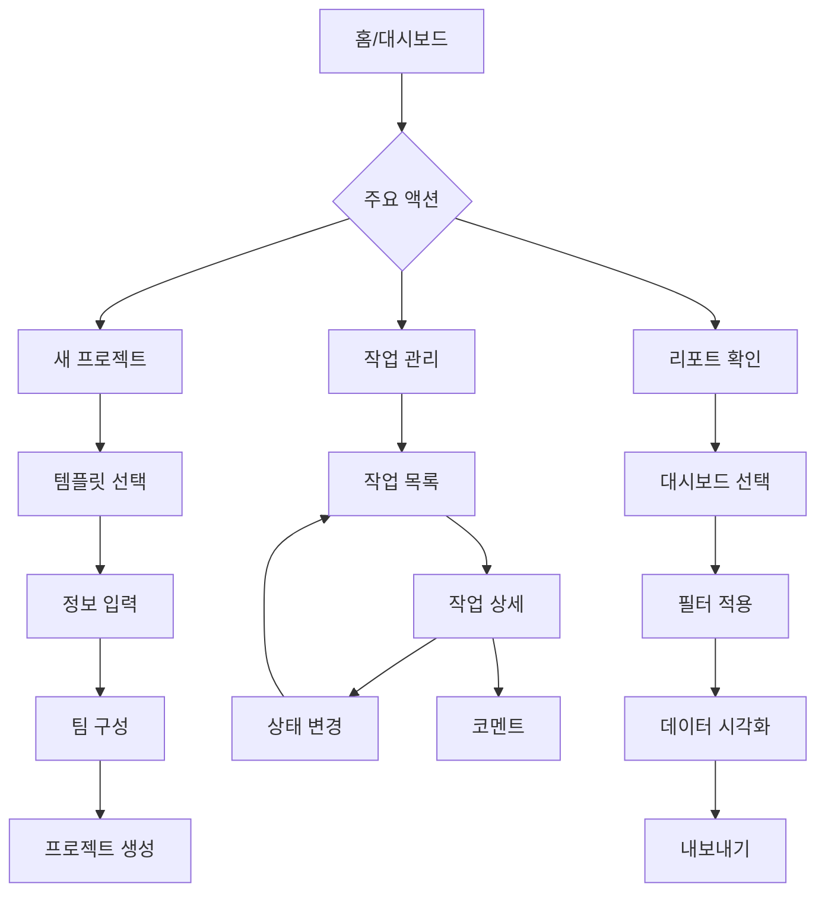

# 📚 정보 아키텍처 문서 (IA Document)

## PM System 2025 Web Application

---

## 1. 정보 아키텍처 개요

### 1.1 IA 전략 및 목표

```typescript
interface IAStrategy {
  vision: '직관적이고 확장 가능한 정보 구조로 생산성 극대화'

  principles: {
    Clarity: '명확한 레이블링과 분류 체계'
    Findability: '3클릭 이내 모든 정보 접근'
    Scalability: '성장 가능한 구조 설계'
    Consistency: '일관된 패턴과 멘탈 모델'
    Flexibility: '다양한 워크플로우 지원'
  }

  objectives: [
    '사용자의 인지 부하 최소화',
    '효율적인 작업 흐름 구축',
    '정보 발견성 극대화',
    '협업 중심 구조 설계',
  ]
}
```

### 1.2 정보 계층 구조

```typescript
interface InformationHierarchy {
  levels: {
    L0: '워크스페이스' // 최상위 컨테이너
    L1: '주요 섹션' // 목표, 프로젝트, 작업
    L2: '서브 섹션' // 상세 뷰, 설정
    L3: '콘텐츠 요소' // 개별 아이템
    L4: '메타데이터' // 속성, 태그, 댓글
  }

  organization: {
    primary: '목표 중심 구조 (Goal-Driven)'
    secondary: '시간축 기반 (Timeline-Based)'
    tertiary: '팀/담당자 기반 (Team-Based)'
  }
}
```

---

## 2. 사이트맵

### 2.1 전체 사이트맵 구조

```
PM System 2025
│
├── 🏠 홈 (대시보드)
│   ├── 위젯 대시보드
│   ├── 오늘의 포커스
│   ├── 빠른 액션
│   └── 활동 피드
│
├── 📂 개인 워크스페이스
│   ├── 빠른 메모
│   ├── 개인 작업
│   ├── 뽀모도로 타이머
│   └── 개인 대시보드
│
├── 📁 프로젝트
│   ├── 프로젝트 목록
│   │   ├── 테이블 뷰
│   │   ├── 칸반 뷰
│   │   ├── 캘린더 뷰
│   │   ├── 타임라인 뷰
│   │   ├── 갤러리 뷰
│   │   └── 리스트 뷰
│   ├── 프로젝트 상세
│   │   ├── 개요
│   │   ├── 작업 관리
│   │   ├── 팀 & 리소스
│   │   ├── 파일 & 문서
│   │   ├── 타임라인
│   │   └── 설정
│   └── 프로젝트 템플릿
│
├── ✅ 작업
│   ├── 내 작업
│   │   ├── 오늘
│   │   ├── 이번 주
│   │   ├── 예정됨
│   │   └── 완료됨
│   ├── 팀 작업
│   │   ├── 담당자별
│   │   ├── 프로젝트별
│   │   └── 상태별
│   └── 작업 상세
│
├── 📊 진행도
│   ├── 개인 진행도
│   └── 프로젝트 진행도
│
├── 👥 팀 (1-5명)
│   ├── 팀원 초대
│   └── 공유 프로젝트
│
├── 🔄 반복 작업
│   ├── 반복 템플릿
│   └── 빠른 복사
│
├── ⚙️ 설정
│   ├── 개인 설정
│   ├── 팀 설정 (5명 제한)
│   └── 업그레이드
│
└── 🔍 검색 & 도움말
    ├── 전역 검색
    ├── 도움말 센터
    ├── 튜토리얼
    └── 지원
```

### 2.2 페이지 계층 상세

```typescript
interface PageHierarchy {
  // 레벨 0: 루트
  root: {
    path: '/'
    redirect: '/dashboard'
    auth: 'required'
  }

  // 레벨 1: 주요 섹션
  primarySections: [
    {
      id: 'dashboard'
      path: '/dashboard'
      label: '대시보드'
      icon: 'Home'
      subnav: false
    },
    {
      id: 'goals'
      path: '/goals'
      label: '목표'
      icon: 'Target'
      subnav: true
      children: [
        { path: '/goals/active'; label: '활성 목표' },
        { path: '/goals/archived'; label: '아카이브' },
        { path: '/goals/metrics'; label: '메트릭' },
      ]
    },
    {
      id: 'projects'
      path: '/projects'
      label: '프로젝트'
      icon: 'Folder'
      subnav: true
      children: [
        { path: '/projects/list'; label: '리스트' },
        { path: '/projects/table'; label: '테이블' },
        { path: '/projects/kanban'; label: '칸반' },
        { path: '/projects/calendar'; label: '캘린더' },
        { path: '/projects/timeline'; label: '타임라인' },
        { path: '/projects/gallery'; label: '갤러리' },
      ]
    },
  ]

  // 레벨 2: 상세 페이지
  detailPages: {
    goal: '/goals/:goalId'
    project: '/projects/:projectId'
    task: '/tasks/:taskId'
    profile: '/team/:userId'
  }

  // 레벨 3: 액션 페이지
  actionPages: {
    create: {
      goal: '/goals/new'
      project: '/projects/new'
      task: '/tasks/new'
    }
    edit: {
      goal: '/goals/:goalId/edit'
      project: '/projects/:projectId/edit'
      task: '/tasks/:taskId/edit'
    }
  }
}
```

---

## 3. 네비게이션 시스템

### 3.1 네비게이션 유형

```typescript
interface NavigationSystem {
  // 글로벌 네비게이션
  global: {
    type: 'Persistent Top Bar'
    items: ['로고/홈', '검색', '알림', '도움말', '사용자 메뉴']
    behavior: '항상 표시, 스크롤 시 축소'
  }

  // 주요 네비게이션
  primary: {
    type: 'Side Navigation'
    items: ['대시보드', '목표', '프로젝트', '작업', '리포트', '팀']
    behavior: '접기/펼치기 가능, 아이콘 모드 지원'
  }

  // 컨텍스트 네비게이션
  contextual: {
    type: 'Tabs/Breadcrumbs'
    location: '콘텐츠 영역 상단'
    behavior: '현재 위치 표시 및 관련 액션 제공'
  }

  // 유틸리티 네비게이션
  utility: {
    type: 'Footer/Settings'
    items: ['설정', '도움말', '피드백', '법적 고지']
  }

  // 모바일 네비게이션
  mobile: {
    type: 'Bottom Tab Bar + Hamburger'
    mainTabs: ['홈', '프로젝트', '작업', '리포트', '더보기']
    behavior: '하단 고정, 스와이프 제스처 지원'
  }
}
```

### 3.2 브레드크럼 구조

```typescript
interface BreadcrumbStructure {
  pattern: '홈 > 섹션 > 서브섹션 > 현재 페이지'

  examples: [
    {
      path: '/projects/proj-123/tasks'
      breadcrumb: [
        { label: '홈'; link: '/' },
        { label: '프로젝트'; link: '/projects' },
        { label: '웹사이트 리뉴얼'; link: '/projects/proj-123' },
        { label: '작업'; current: true },
      ]
    },
  ]

  rules: [
    '최대 4단계까지 표시',
    '긴 레이블은 말줄임(...) 처리',
    '현재 페이지는 링크 없음',
    '모바일에서는 마지막 2단계만 표시',
  ]
}
```

### 3.3 메뉴 구조 및 우선순위

```typescript
interface MenuStructure {
  // 사이드바 메뉴
  sidebar: {
    sections: [
      {
        id: 'workspace'
        title: '워크스페이스'
        items: [
          { label: '대시보드'; icon: 'LayoutDashboard'; badge: null },
          { label: '내 작업'; icon: 'CheckSquare'; badge: '12' },
          { label: '캘린더'; icon: 'Calendar'; badge: null },
        ]
      },
      {
        id: 'planning'
        title: '계획'
        items: [
          { label: '목표'; icon: 'Target'; badge: null },
          { label: '프로젝트'; icon: 'Folder'; badge: '3' },
          { label: '로드맵'; icon: 'Map'; badge: 'new' },
        ]
      },
      {
        id: 'collaboration'
        title: '협업'
        collapsible: true
        items: [
          { label: '팀'; icon: 'Users'; badge: null },
          { label: '문서'; icon: 'FileText'; badge: null },
          { label: '채팅'; icon: 'MessageSquare'; badge: '5' },
        ]
      },
    ]
  }

  // 컨텍스트 메뉴
  contextMenu: {
    task: ['상세보기', '편집', '상태 변경', '담당자 변경', '복사', '삭제']
    project: ['열기', '편집', '복제', '템플릿으로 저장', '아카이브', '삭제']
  }
}
```

---

## 4. 콘텐츠 조직 및 분류

### 4.1 콘텐츠 분류 체계

```typescript
interface ContentTaxonomy {
  // 주요 분류 기준
  primaryClassification: {
    byHierarchy: ['목표', '프로젝트', '작업', '서브태스크']
    byStatus: ['계획', '진행중', '완료', '보류', '취소']
    byPriority: ['긴급', '높음', '중간', '낮음']
    byTimeframe: ['오늘', '이번주', '이번달', '분기', '연간']
  }

  // 메타데이터 구조
  metadata: {
    required: ['id', 'title', 'createdAt', 'createdBy', 'status']
    optional: ['description', 'tags', 'attachments', 'comments', 'customFields']
  }

  // 태깅 시스템
  tagging: {
    categories: {
      functional: ['Frontend', 'Backend', 'Design', 'Marketing']
      technical: ['Bug', 'Feature', 'Enhancement', 'Documentation']
      workflow: ['Review', 'Blocked', 'Ready', 'Testing']
    }
    rules: ['최대 10개 태그', '자동 제안 기능', '커스텀 태그 생성 가능']
  }
}
```

### 4.2 콘텐츠 템플릿

```typescript
interface ContentTemplates {
  // 목표 템플릿
  goalTemplate: {
    structure: {
      header: {
        title: 'string'
        emoji: 'string'
        colorTag: 'string'
        targetDate: 'date'
      }
      body: {
        description: 'rich text'
        keyResults: 'array'
        metrics: 'object'
      }
      relations: {
        projects: 'array<ProjectId>'
        owner: 'UserId'
        stakeholders: 'array<UserId>'
      }
    }
  }

  // 프로젝트 템플릿
  projectTemplate: {
    types: [
      {
        name: '스프린트'
        duration: '2주'
        sections: ['백로그', '진행중', '리뷰', '완료']
        automation: ['일일 스탠드업', '회고']
      },
      {
        name: '워터폴'
        duration: '3개월'
        phases: ['기획', '설계', '개발', '테스트', '배포']
        milestones: true
      },
      {
        name: '칸반'
        duration: '지속적'
        columns: ['백로그', '준비', '진행중', '리뷰', '완료']
        wip_limits: true
      },
    ]
  }
}
```

---

## 5. 사용자 플로우

### 5.1 핵심 사용자 플로우

```typescript
interface CriticalUserFlows {
  // Flow 1: 새 프로젝트 시작
  createProject: {
    entry: '대시보드 or 프로젝트 목록'
    steps: [
      { step: 1; action: '새 프로젝트 버튼 클릭'; page: '/projects' },
      { step: 2; action: '템플릿 선택'; page: '/projects/new' },
      { step: 3; action: '기본 정보 입력'; page: '/projects/new/details' },
      { step: 4; action: '팀원 할당'; page: '/projects/new/team' },
      { step: 5; action: '작업 설정'; page: '/projects/new/tasks' },
      { step: 6; action: '생성 완료'; page: '/projects/:id' },
    ]
    alternativePaths: ['템플릿 없이 시작', 'CSV 임포트', '다른 프로젝트 복제']
  }

  // Flow 2: 일일 작업 관리
  dailyWorkflow: {
    entry: '대시보드'
    steps: [
      { step: 1; action: '오늘의 작업 확인'; page: '/dashboard' },
      { step: 2; action: '작업 선택'; page: '/tasks/:id' },
      { step: 3; action: '상태 업데이트'; interaction: 'inline' },
      { step: 4; action: '시간 기록'; interaction: 'modal' },
      { step: 5; action: '코멘트 추가'; interaction: 'sidebar' },
      { step: 6; action: '다음 작업'; page: '/tasks' },
    ]
  }

  // Flow 3: 팀 협업
  collaboration: {
    entry: '알림 or 멘션'
    steps: [
      { step: 1; action: '알림 확인'; location: 'notification_center' },
      { step: 2; action: '컨텍스트 이동'; page: '/projects/:id/discussions' },
      { step: 3; action: '스레드 참여'; interaction: 'inline_reply' },
      { step: 4; action: '파일 공유'; interaction: 'drag_drop' },
      { step: 5; action: '작업 생성'; interaction: 'quick_action' },
    ]
  }
}
```

### 5.2 플로우 다이어그램



---

## 6. URL 구조 및 라우팅

### 6.1 URL 패턴

```typescript
interface URLStructure {
  // URL 패턴 규칙
  patterns: {
    list: '/{resource}'
    detail: '/{resource}/{id}'
    action: '/{resource}/{id}/{action}'
    nested: '/{parent}/{parentId}/{child}/{childId}'
  }

  // 실제 URL 예제
  examples: {
    // 목록 페이지
    goalsList: '/goals'
    projectsList: '/projects'
    tasksList: '/tasks'

    // 상세 페이지
    goalDetail: '/goals/goal-uuid-123'
    projectDetail: '/projects/proj-uuid-456'
    taskDetail: '/tasks/task-uuid-789'

    // 액션 페이지
    editGoal: '/goals/goal-uuid-123/edit'
    projectSettings: '/projects/proj-uuid-456/settings'
    taskHistory: '/tasks/task-uuid-789/history'

    // 중첩 리소스
    projectTasks: '/projects/proj-uuid-456/tasks'
    projectTaskDetail: '/projects/proj-uuid-456/tasks/task-uuid-789'

    // 필터 및 쿼리
    filteredTasks: '/tasks?status=in_progress&assignee=user-123'
    searchResults: '/search?q=frontend&type=task&date=this_week'
  }

  // URL 파라미터
  queryParameters: {
    filtering: {
      status: ['pending', 'in_progress', 'completed']
      priority: ['urgent', 'high', 'medium', 'low']
      assignee: 'userId'
      date_range: ['today', 'week', 'month', 'custom']
    }
    pagination: {
      page: 'number'
      limit: 'number'
      offset: 'number'
    }
    sorting: {
      sort_by: ['created_at', 'updated_at', 'priority', 'due_date']
      order: ['asc', 'desc']
    }
    view: {
      layout: ['table', 'board', 'calendar', 'timeline']
      groupBy: ['status', 'assignee', 'priority']
    }
  }
}
```

### 6.2 라우팅 구조

```typescript
// app/routes.ts
const routes = {
  // 인증 라우트 (Supabase Auth 자동 처리)
  auth: {
    login: '/auth/login', // Supabase OAuth 및 Magic Link 처리
    signup: '/auth/signup', // Supabase 회원가입 플로우
    callback: '/auth/callback', // OAuth 콜백 처리
    magicLink: '/auth/magic-link', // Magic Link 인증 처리
  },

  // 보호된 라우트
  protected: {
    dashboard: {
      path: '/dashboard',
      layout: 'main',
      permissions: ['member', 'admin', 'owner'],
    },
    goals: {
      path: '/goals/*',
      layout: 'main',
      permissions: ['member', 'admin', 'owner'],
    },
    admin: {
      path: '/admin/*',
      layout: 'admin',
      permissions: ['admin', 'owner'],
    },
  },

  // 동적 라우트
  dynamic: {
    '/projects/[projectId]': {
      component: 'ProjectDetail',
      preload: ['project', 'tasks', 'team'],
    },
    '/projects/[projectId]/tasks/[taskId]': {
      component: 'TaskDetail',
      preload: ['task', 'comments', 'activity'],
    },
  },

  // 리다이렉트
  redirects: {
    '/': '/dashboard',
    '/home': '/dashboard',
    '/login': '/auth/login',
  },
}
```

---

## 7. 검색 및 필터링 전략

### 7.1 검색 시스템

```typescript
interface SearchSystem {
  // 전역 검색
  globalSearch: {
    scope: ['모든 콘텐츠', '제목', '설명', '코멘트', '파일명']
    features: ['자동완성', '오타 교정', '동의어 처리', '한글 초성 검색']
    filters: {
      type: ['목표', '프로젝트', '작업', '문서', '사용자']
      date: ['오늘', '이번주', '이번달', '전체']
      owner: '사용자 선택'
      status: '상태 선택'
    }
    ranking: {
      factors: ['정확도', '최신성', '인기도', '사용자 관련성']
    }
  }

  // 컨텍스트 검색
  contextualSearch: {
    project: {
      scope: '현재 프로젝트 내'
      quickFilters: ['내 작업', '미완료', '이번 주', '긴급']
    }
    workspace: {
      scope: '워크스페이스 전체'
      savedSearches: true
      searchHistory: true
    }
  }

  // 고급 검색
  advancedSearch: {
    operators: ['AND', 'OR', 'NOT', 'exact phrase', 'wildcard (*)', 'range (date, number)']
    syntax: {
      exact: '"정확한 구문"'
      exclude: '-제외할단어'
      wildcard: 'pro*'
      field: 'title:프로젝트'
      date: 'created:2025-01-01..2025-12-31'
    }
  }
}
```

### 7.2 필터링 시스템

```typescript
interface FilteringSystem {
  // 필터 유형
  filterTypes: {
    // 단일 선택 필터
    single: {
      status: ['전체', '진행중', '완료', '보류']
      priority: ['전체', '긴급', '높음', '중간', '낮음']
    }

    // 다중 선택 필터
    multiple: {
      tags: ['Frontend', 'Backend', 'Design', '기타']
      assignees: '팀원 목록'
      projects: '프로젝트 목록'
    }

    // 범위 필터
    range: {
      date: {
        presets: ['오늘', '어제', '이번주', '지난주', '이번달']
        custom: '날짜 선택기'
      }
      progress: {
        min: 0
        max: 100
        step: 10
      }
    }
  }

  // 필터 조합
  filterCombination: {
    saved: '자주 사용하는 필터 조합 저장'
    recent: '최근 사용한 필터'
    smart: [
      {
        name: '내 긴급 작업'
        filters: {
          assignee: 'currentUser'
          priority: 'urgent'
          status: '!completed'
        }
      },
      {
        name: '이번 주 마감'
        filters: {
          dueDate: 'thisWeek'
          status: '!completed'
        }
      },
    ]
  }

  // 필터 UI
  filterUI: {
    desktop: '사이드바 패널'
    mobile: '바텀 시트'
    quickFilters: '상단 필터 바'
    clearAll: '전체 초기화 버튼'
  }
}
```

---

## 8. 페이지 템플릿 및 레이아웃

### 8.1 페이지 템플릿 구조

```typescript
interface PageTemplates {
  // 목록 페이지 템플릿
  listTemplate: {
    components: {
      header: {
        title: '페이지 제목'
        actions: ['새로 만들기', '가져오기', '내보내기']
        tabs: '뷰 타입 선택'
      }
      filters: {
        position: 'left_sidebar | top_bar'
        collapsible: true
      }
      content: {
        viewTypes: ['table', 'grid', 'board', 'timeline']
        pagination: 'bottom'
        bulkActions: 'top'
      }
    }
    layout: `
      [Header]
      [Filters | Content]
      [Pagination]
    `
  }

  // 상세 페이지 템플릿
  detailTemplate: {
    components: {
      breadcrumb: 'top'
      header: {
        title: 'editable'
        status: 'badge'
        actions: 'dropdown_menu'
      }
      sidebar: {
        metadata: '속성 패널'
        activity: '활동 기록'
      }
      main: {
        tabs: ['개요', '작업', '파일', '댓글']
        content: 'dynamic'
      }
    }
    layout: `
      [Breadcrumb]
      [Header]
      [Main Content | Sidebar]
    `
  }

  // 대시보드 템플릿
  dashboardTemplate: {
    components: {
      widgets: {
        types: ['stat', 'chart', 'list', 'calendar']
        arrangement: 'grid'
        customizable: true
      }
    }
    layout: `
      [Widget Grid - Responsive]
    `
  }

  // 폼 템플릿
  formTemplate: {
    components: {
      header: '단계 표시기'
      form: {
        layout: 'single_column | two_column'
        sections: 'collapsible'
        validation: 'inline'
      }
      footer: {
        actions: ['취소', '저장', '저장 후 계속']
      }
    }
    layout: `
      [Progress Steps]
      [Form Content]
      [Action Buttons]
    `
  }
}
```

### 8.2 반응형 레이아웃 전략

```typescript
interface ResponsiveLayouts {
  breakpoints: {
    mobile: '< 640px'
    tablet: '640px - 1024px'
    desktop: '> 1024px'
    wide: '> 1536px'
  }

  layoutAdaptations: {
    mobile: {
      navigation: 'bottom_tabs'
      sidebar: 'full_screen_overlay'
      content: 'single_column'
      tables: 'card_view'
      modals: 'full_screen'
    }
    tablet: {
      navigation: 'collapsible_sidebar'
      sidebar: 'slide_over'
      content: 'two_column_when_possible'
      tables: 'horizontal_scroll'
      modals: 'centered_medium'
    }
    desktop: {
      navigation: 'fixed_sidebar'
      sidebar: 'inline_panel'
      content: 'multi_column'
      tables: 'full_table'
      modals: 'centered_large'
    }
  }

  priorityContent: {
    mobile: ['주요 액션', '현재 작업', '알림']
    hidden: ['보조 네비게이션', '상세 메타데이터', '고급 필터']
  }
}
```

---

## 9. 메타데이터 및 정보 구조

### 9.1 메타데이터 스키마

```typescript
interface MetadataSchema {
  // 공통 메타데이터
  common: {
    id: 'UUID'
    title: 'string (required)'
    description: 'text (optional)'
    createdAt: 'timestamp'
    createdBy: 'userId'
    updatedAt: 'timestamp'
    updatedBy: 'userId'
    tags: 'array<string>'
    customFields: 'object'
  }

  // 엔티티별 메타데이터
  entities: {
    goal: {
      extends: 'common'
      specific: {
        targetDate: 'date'
        colorTag: 'enum'
        metrics: {
          kpi: 'array<object>'
          progress: 'percentage'
        }
      }
    }

    project: {
      extends: 'common'
      specific: {
        status: 'enum'
        priority: 'enum'
        dateRange: {
          start: 'date'
          end: 'date'
        }
        budget: 'number'
        resources: 'array<resource>'
      }
    }

    task: {
      extends: 'common'
      specific: {
        isCompleted: 'boolean'
        dueDate: 'datetime'
        estimatedHours: 'number'
        actualHours: 'number'
        checklist: 'array<checkItem>'
        dependencies: 'array<taskId>'
      }
    }
  }

  // SEO 메타데이터
  seo: {
    title: '페이지 제목 - PM System 2025'
    description: '최대 155자'
    keywords: 'array<string>'
    ogImage: 'url'
    canonical: 'url'
  }
}
```

### 9.2 데이터 관계 구조

```typescript
interface DataRelationships {
  // 계층 관계
  hierarchical: {
    workspace: {
      children: ['goals', 'projects', 'teams']
      parent: null
    }
    goal: {
      children: ['projects']
      parent: 'workspace'
    }
    project: {
      children: ['tasks', 'milestones']
      parent: 'goal'
    }
    task: {
      children: ['subtasks', 'checklist']
      parent: 'project'
    }
  }

  // 참조 관계
  references: {
    'task.assignee': 'user.id'
    'project.team': 'team.id'
    'comment.author': 'user.id'
    'attachment.uploadedBy': 'user.id'
  }

  // 다대다 관계
  manyToMany: {
    project_assignees: {
      project: 'project.id'
      user: 'user.id'
    }
    task_tags: {
      task: 'task.id'
      tag: 'tag.id'
    }
  }
}
```

---

## 10. 권한 및 접근 제어

### 10.1 권한 매트릭스

```typescript
interface PermissionMatrix {
  roles: {
    owner: {
      level: 0
      permissions: ['*'] // 모든 권한
      label: '소유자'
    }
    admin: {
      level: 1
      permissions: ['workspace.manage', 'members.manage', 'projects.manage', 'settings.manage']
      label: '관리자'
    }
    member: {
      level: 2
      permissions: ['projects.create', 'projects.edit.assigned', 'tasks.manage', 'comments.create']
      label: '멤버'
    }
    viewer: {
      level: 3
      permissions: ['*.read', 'comments.create']
      label: '뷰어'
    }
  }

  // 리소스별 권한
  resourcePermissions: {
    workspace: {
      read: ['owner', 'admin', 'member', 'viewer']
      update: ['owner', 'admin']
      delete: ['owner']
    }
    project: {
      create: ['owner', 'admin', 'member']
      read: ['owner', 'admin', 'member', 'viewer']
      update: ['owner', 'admin', 'assignee']
      delete: ['owner', 'admin', 'creator']
    }
    task: {
      create: ['owner', 'admin', 'member']
      read: ['owner', 'admin', 'member', 'viewer']
      update: ['owner', 'admin', 'member', 'assignee']
      delete: ['owner', 'admin', 'creator', 'assignee']
    }
  }

  // 특수 권한
  specialPermissions: {
    billing: ['owner']
    integrations: ['owner', 'admin']
    export: ['owner', 'admin', 'member']
    bulkOperations: ['owner', 'admin']
  }
}
```

### 10.2 접근 제어 패턴

```typescript
interface AccessControlPatterns {
  // 페이지 레벨 접근 제어
  pageAccess: {
    public: ['/auth/login', '/auth/signup', '/pricing', '/features']
    authenticated: ['/dashboard', '/projects', '/tasks']
    roleSpecific: {
      '/admin': ['owner', 'admin']
      '/billing': ['owner']
      '/settings/workspace': ['owner', 'admin']
    }
  }

  // 기능 레벨 접근 제어
  featureAccess: {
    conditionalDisplay: {
      deleteButton: 'canDelete(resource, user)'
      editButton: 'canEdit(resource, user)'
      inviteButton: "hasRole(['owner', 'admin'])"
    }

    apiProtection: {
      middleware: 'checkPermission'
      validation: 'validateRequest'
      rateLimit: 'byUserTier'
    }
  }

  // 데이터 레벨 접근 제어
  dataAccess: {
    rowLevelSecurity: true
    fieldLevelSecurity: {
      sensitive: ['salary', 'ssn', 'bankAccount']
      conditional: {
        email: 'owner || self'
        phone: 'owner || admin || self'
      }
    }
  }
}
```

---

## 11. 상태 관리 및 데이터 플로우

### 11.1 애플리케이션 상태 구조

```typescript
interface ApplicationState {
  // 전역 상태
  global: {
    user: {
      profile: 'UserProfile'
      preferences: 'UserPreferences'
      permissions: 'Permissions[]'
    }
    workspace: {
      current: 'Workspace'
      members: 'Member[]'
      settings: 'WorkspaceSettings'
    }
    ui: {
      theme: 'light | dark'
      sidebarOpen: 'boolean'
      activeModal: 'string | null'
      notifications: 'Notification[]'
    }
  }

  // 도메인 상태
  domain: {
    goals: {
      list: 'Goal[]'
      selected: 'Goal | null'
      filters: 'FilterState'
      sorting: 'SortState'
    }
    projects: {
      list: 'Project[]'
      selected: 'Project | null'
      view: 'ViewType'
    }
    tasks: {
      list: 'Task[]'
      selected: 'Task | null'
      groupBy: 'GroupingOption'
    }
  }

  // 캐시 상태
  cache: {
    queries: 'QueryCache'
    mutations: 'MutationQueue'
    optimistic: 'OptimisticUpdates'
  }
}
```

### 11.2 데이터 플로우 패턴

```typescript
interface DataFlowPatterns {
  // 데이터 페칭 전략
  fetchingStrategy: {
    initial: 'SSR + Hydration'
    navigation: 'Client-side with cache'
    realtime: 'WebSocket subscription'
    background: 'SWR revalidation'
  }

  // 상태 동기화
  synchronization: {
    local: 'Zustand stores'
    server: 'React Query'
    realtime: 'Supabase Realtime'
    offline: 'IndexedDB + Service Worker'
  }

  // 업데이트 패턴
  updatePatterns: {
    optimistic: {
      apply: '즉시 UI 업데이트'
      rollback: '실패 시 되돌리기'
    }
    pessimistic: {
      wait: '서버 응답 대기'
      update: '성공 후 업데이트'
    }
    eventual: {
      queue: '오프라인 큐'
      sync: '연결 복구 시 동기화'
    }
  }
}
```

---

## 12. 정보 아키텍처 검증

### 12.1 IA 검증 체크리스트

```typescript
interface IAValidation {
  // 카드 소팅 결과
  cardSorting: {
    participants: 20
    agreement: '85%'
    categories: {
      clear: ['목표', '프로젝트', '작업']
      ambiguous: ['리포트', '분석']
      suggestions: ['대시보드 통합 필요']
    }
  }

  // 트리 테스팅 결과
  treeTestingResults: {
    taskCompletion: '92%'
    directness: '78%'
    timeToComplete: '평균 45초'
    problematicPaths: ['설정 > 자동화', '리포트 > 커스텀']
  }

  // 사용성 테스트
  usabilityMetrics: {
    findability: {
      score: 8.5
      issues: ['고급 필터 발견 어려움']
    }
    learnability: {
      score: 9.0
      feedback: ['직관적 구조']
    }
    efficiency: {
      score: 7.5
      improvements: ['빠른 액션 추가 필요']
    }
  }

  // 개선 권장사항
  recommendations: [
    '검색 기능 강화',
    '개인화된 네비게이션',
    '컨텍스트 도움말 추가',
    '자주 사용하는 기능 빠른 접근',
  ]
}
```

### 12.2 IA 거버넌스

```typescript
interface IAGovernance {
  // 유지보수 계획
  maintenance: {
    review: '분기별 IA 리뷰'
    updates: '월별 네비게이션 분석'
    testing: '신규 기능 추가 시 IA 영향 평가'
  }

  // 확장성 고려사항
  scalability: {
    maxDepth: '4단계 제한'
    maxItems: '사이드바 7±2 항목'
    growth: '모듈식 확장 가능 구조'
  }

  // 문서화
  documentation: {
    siteMap: '항상 최신 유지'
    flowDiagrams: '주요 플로우 문서화'
    guidelines: 'IA 가이드라인 문서'
  }

  // 측정 지표
  metrics: {
    navigation: {
      clickDepth: '평균 클릭 수'
      taskSuccess: '작업 완료율'
      errorRate: '잘못된 경로 선택률'
    }
    search: {
      usage: '검색 사용률'
      success: '검색 성공률'
      refinement: '필터 사용률'
    }
  }
}
```

---

## 13. 모바일 IA 특별 고려사항

### 13.1 모바일 네비게이션 패턴

```typescript
interface MobileIA {
  // 모바일 특화 네비게이션
  navigation: {
    primary: {
      type: 'Bottom Tab Bar'
      items: 5 // 최대 5개
      tabs: ['홈', '프로젝트', '추가', '작업', '더보기']
    }
    secondary: {
      type: 'Hamburger Menu'
      trigger: '더보기 탭'
      content: '전체 메뉴'
    }
    contextual: {
      type: 'Floating Action Button'
      actions: ['새 작업', '빠른 메모']
    }
  }

  // 제스처 기반 인터랙션
  gestures: {
    swipe: {
      left: '다음 항목'
      right: '이전 항목'
      down: '새로고침'
      up: '더 보기'
    }
    longPress: '컨텍스트 메뉴'
    pinch: '확대/축소'
  }

  // 모바일 우선순위
  priorities: {
    visible: ['현재 작업', '알림', '빠른 추가']
    hidden: ['고급 설정', '상세 리포트', '벌크 작업']
    progressive: '점진적 공개'
  }
}
```
